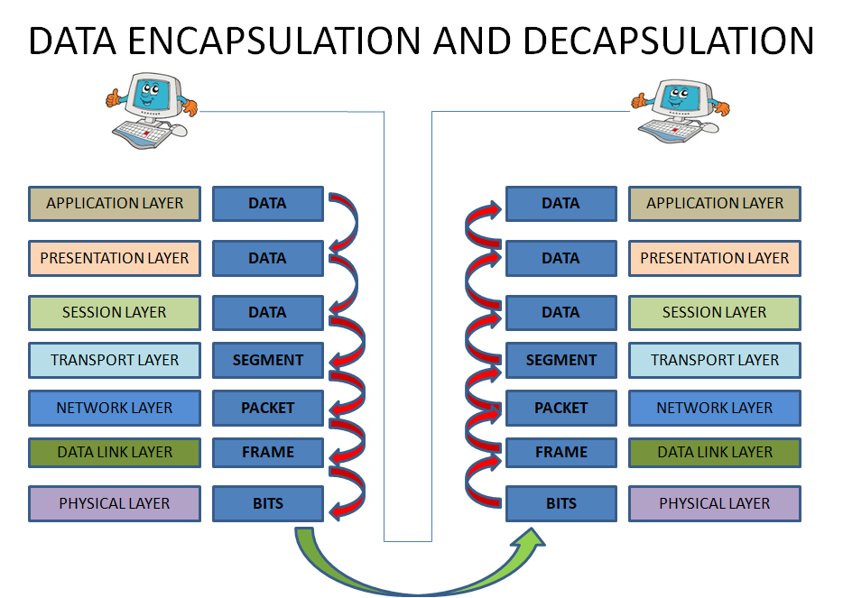
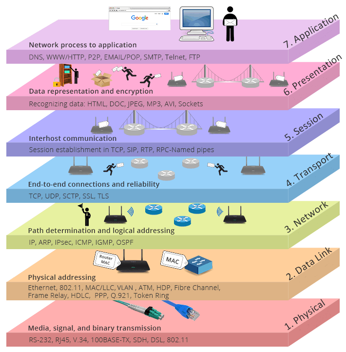
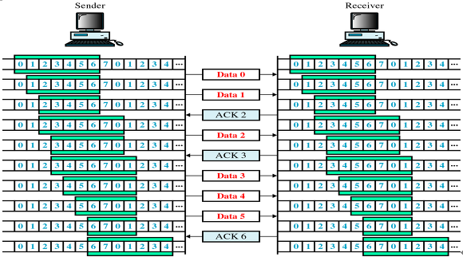

 - [OSI 7계층](#네트워크-osi-7계층)
 - [TCP](#tcp)
- [TCP 헤더](#tcp-header)
-  [TCP의 3 way handshake와 4 way handshake](#tcp의-3-way-handshake와-4-way-handshake)
## 네트워크 OSI 7 계층
- 국제표준화기구(ISO)에서 개발한 모델로, 컴퓨터 네트워크 프로토콜 디자인과 통신을 계층으로 나누어 설명한 것
- 현재 대부분은 TCP/IP 모델인 4계층으로 이루어짐.
- 실제로 사용되지는 않는 모델
- Encapsulation/Decapsulation
	- 
	- 캡슐화 : 데이터를 패킷 형태로 래핑하고 다음 계층으로 전달하는 과정
	- 디캡슐화 : 수신한 패킷에서 데이터를 추출하고 상위 계층에 전달하는 프로세스

### Physical Layer
- 물리적인 전송 매체(케이블, 광섬유, 무선)
- 비트 스트림을 전송하고 전기적, 광학적 신호로 변환
- 장비 : 허브
- 전송 단위 : Bit
### Data Link Layer
- Frame을 전송하고 수신하는 역할
- Mac Address를 사용하여 장치를 식별하고 오류 감지 및 수정
- 장비 : 스위치
- 전송 단위 : Frame
### Network Layer
- 패킷의 라우팅과 전달을 관리
- 라우팅, IP 주소 할당 및 경로 선택과 같은 기능 수행
- 장비 : 라우터
- 전송 단위 : Packet

### Transport Layer
- 데이터 송신 및 수신
- 포트 번호 및 전송 제어 정보를 사용하여 데이터 흐름을 관리/복구
- 전송 단위 : Segment

### Session Layer
- 세션을 설정, 유지 및 해제하며, 데이터 교환에 대한 동기화와 제어
- 멀티미디어 데이터 스트림의 시간적 동기화
- 전송 단위 : Message

### Presentation Layer
- 데이터의 형식 변환, 데이터 암호화 및 압축, 문자 인코딩 변환과 같은 데이터 형식 및 표현에 관한 작업
- 전송 단위 : Message

### Application Layer
- 최종 사용자 애플리케이션과 직접 상호작용
- 전송 단위 : Message

## TCP
- TCP(Transmission Control Protocol)는 Transport Layer의 프로토콜 중에 하나
- 데이터를 안정적으로 전송하기 위해 사용
- IP를 기반으로 패킷을 목적지까지 전달

### TCP의 특징
1. Connection-Oriented
	- 통신을 시작하기 전에 클라이언트와 서버 간에 연결을 설정
2. 신뢰성 있는 데이터 전송
3. Flow Control(흐름 제어)
4. Congestion Control(혼잡 제어)
5. Full-Duplex
	- 양방향 데이터 통신
6. Point to Point
	- 각 연결이 정확히 2개의 종단점을 가짐

### TCP Header

|필드|내용|크기(bits)|
|----|----|----|
|Source Port, Destination Port|TCP로 연결되는 가상 회선 양단의 송수신 프로세스에 할당되는 포트 주소|16|
|Sequence Number|송신자가 지정하는 순서 번호, **전송되는 바이트 수** 기준으로 증가 SYN = 1 : 초기 시퀀스 번호. ACK 번호는 이 값에 + 1|32|
|Acknowledgment(ACK) Number|수신 프로세스가 제대로 **수신한 바이트의 수** 응답 용|32|
|Header Length(Data Offset)|TCP 헤더 길이를 4바이트 단위로 표시(최소 20, 최대 60 바이트)|4|
|Resv(Reserved)|나중을 위해 0으로 채워진 예약 필드|6|
|Flag Bit|SYN, ACK, FIN 등 제어 번호(아래 표 참고)|6|
|Window Size|**수신 윈도우의 버퍼 크기** 지정(0이면 송신 중지). 상대방의 확인 없이 전송 가능한 최대 바이트 수|16|
|TCP Checksum|헤더와 데이터의 에러 확인 용도|16|
|Urgent Pointer(긴급 위치)|현재 순서 번호부터 표시된 바이트까지 긴급한 데이터임을 표시, URG 플래그 비트가 지정된 경우에만 유효|16|
|Options|추가 옵션 있을 경우 표시|0~40|

 |종류|내용|
    |----|----|
    |URG|긴급 위치 필드 유효 여부 설정|
    |ACK|응답 유효 여부 설정. 최초의 SYN 패킷 이후 모든 패킷은 ACK 플래그 설정 필요. 데이터를 잘 받았으면 긍정 응답으로 ACK(=SYN+1) 전송|
    |PSH|수신측에 버퍼링된 데이터를 상위 계층에 즉시 전달할 때|
    |RST|연결 리셋 응답 혹은 유효하지 않은 세그먼트 응답|
    |SYN|연결 설정 요청. 양쪽이 보낸 최초 패킷에만 SYN 플래그 설정|
    |FIN|연결 종료 의사 표시|
    

## TCP의 3 way handshake와 4 way handshake

### 3-way handshake
- tcp 통신을 하기 전에 정확한 전송을 보장하기 위해 사전에 확인하는 과정

1. 클라이언트는 서버에 접속을 요청하는 SYN 패킷을 보낸다. SYN 을 보내고 SYN/ACK 응답을 기다리는SYN_SENT 상태가 된다.
2. 서버는 SYN요청을 받고 클라이언트에게 요청을 수락한다는 ACK 와 SYN flag 가 설정된 패킷을 발송하고 클라이언트가 다시 ACK으로 응답하기를 기다린다. 이때 서버는 SYN_RECEIVED 상태가 된다.
3. A클라이언트는 B서버에게 ACK을 보내고 이후로부터는 연결이 이루어지고 데이터가 오가게 되는것이다. 이때의 B서버 상태가 ESTABLISHED가 된다.
- SYN 패킷은 초기 순서 번호(ISN)와 플래그(SYN)가 설정되어 있다. 

### 4-way handshake
- tcp 통신을 종료하기 위해 수행되는 절차

1. 클라이언트가 연결을 종료하겠다는 FIN플래그를 전송한다.
2. 서버는 일단 확인메시지를 보내고 자신의 통신이 끝날때까지 기다리는데 이 상태가 **TIME_WAIT**상태다.
3. 서버가 통신이 끝났으면 연결이 종료되었다고 클라이언트에게 FIN플래그를 전송한다.
4. 클라이언트는 확인했다는 메시지를 보낸다.
5. 서버에서 FIN을 전송하기 전에 전송한 패킷이 FIN 패킷보다 늦게 도착한다면 데이터가 유실될 가능성이 있다. 따라서 이러한 현상에 대비하여 서버로부터 FIN을 수신하더라도 일정시간동안 세션을 남겨놓고 패킷을 기다린다. 이 과정을 TIME_WAIT이라고 부른다. 일정 시간이 지나면 세션을 만료하고 연결을 종료시키며 CLOSE 상태로 변화한다.

- 임의의 난수로 시퀀스 넘버를 생성하고 SYN 패킷에 담아 보낸다. 서버에서도 마찬가지.
	- 새로운 연결을 할 때마다 새로운 Sequence Number를 사용하는데 여기서 최초로 랜덤하게 골라지는게 ISN.
	 - 임의의 난수를 생성하는 이유? TCP는 데이터를 보낼 때마다 데이터에 고유한 번호를 부여한다. 이 번호를 사용해서 수신자가 중복된 데이터를 폐기하거나 아니면 순서가 뒤바뀌어 수신됐을 때 데이터를 순서대로 재구성할 수 있다.

-  ❓TCP 연결 설정 과정과 연결 종료 과정의 단계 수가 차이가 나는 이유는?
	- Client가 데이터 전송을 마쳤다고 하더라도 Server는 아직 보낼 데이터가 남아있을 수 있기 때문에 일단 FIN에 대한 ACK만 보내고, 데이터를 모두 전송한 후에 자신도 FIN 메시지를 보내기 때문이다.

## TCP 흐름제어 / 혼잡제어
### TCP 흐름제어
- 데이터를 송신하는 곳과 수신하는 곳의 데이터 처리 속도를 조절하여 수신자의 버퍼 오버플로우를 방지하는 것
- 송신하는 곳에서 감당이 안되게 많은 데이터를 빠르게 보내 수신하는 곳에서 문제가 일어나는 것을 막는다.

#### 해결방법
1. **Stop and Wait** 
		
		
	- 매번 전송한 패킷에 대해 확인 응답을 받아야만 그 다음 패킷을 전송하는 방법
	- 단점 
		- 전송 효올이 매우 안좋음
2.  **Sliding Window** (Go Back N ARQ)
		
	- 수신측에서 설정한 윈도우 크기만큼 송신측에서 확인응답없이 세그먼트를 전송할 수 있게 하여 데이터 흐름을 동적으로 조절하는 제어기법
	- 목적 : 전송은 되었지만, acked를 받지 못한 byte의 숫자를 파악하기 위해 사용하는 protocol
	- 먼저 윈도우에 포함되는 모든 패킷을 전송하고, 그 패킷들의 전달이 확인되는대로 이 윈도우를 옆으로 옮김으로써 그 다음 패킷들을 전송

### TCP 혼잡제어
- 네트워크 내의 패킷 수가 넘치게 증가하지 않도록 방지하는 것
- 정보의 소통량이 과다하면 패킷을 조금만 전송하여 혼잡 붕괴 현상이 일어나는 것을 막는다.

#### 해결방법

1. Slow Start
      - 혼잡이 감지되면 Window의 크기를 1로 줄임. 그 후 Threshold 전까지 지수적으로 증가하다가 Threshold 이후 선형적으로 증가하는 방식
2. AMID
      - Window Size를 증가할 때는 선형적으로, 감소할 때는 절반씩 줄이는 방법
3. TCP Tahoe, TCP Reno
	- 앞서 언급한 2가지를 적절히 활용하는 방법

## UDP
- User Datagram Protocol의 약자로 데이터를 데이터그램 단위로 처리하는 Transport Layer의 프로토콜
- 특징
	- 비연결
        - 신뢰성X
        - 신속성
        - 주로 실시간 방송과 온라인 게임 등에서 사용됨
- DNS에서도 UDP를 사용한다.
	- request 양이 적다.
	- request에 대한 손실은 application layer에서 제어가 가능하다.
### UDP Header

- Source port : 시작 포트
- Destination port : 도착지 포트
- Length : 길이
- _Checksum_ : 오류 검출
    - 중복 검사의 한 형태로, 오류 정정을 통해 공간이나 시간 속에서 송신된 자료의 무결성을 보호하는 단순한 방법이다.

## 대칭키 & 공개키

### 대칭키(Symmetric Key)
- 암호화와 복호화에 같은 암호키를 사용하는 알고리즘
- 동일한 키를 주고받기 때문에 매우 빠르다는 장점이 잇음
- 하지만 해킹 위험에 노출 가능

### 비대칭키(Asymmetric Key)
- 암호화와 복호화에 사용하는 암호키를 분리한 알고리즘
- 자신이 가지고 있는 고유한 암호키로만 복호화할 수 있는 암호화 키를 대중에 공개함.
1. A가 웹 상에 공개된 'B의 공개키'를 이용해 정보를 암호화함.
2. B는 자신의 비밀키로 정보를 복호화, A의 공개키로 응답을 암호화하여 A에개 보냄
3. A는 자신의 비밀키로 암호화된 응답문을 복호화함

## HTTP & HTTPS

### HTTP
HTTP(Hyper Text Transfer Protocol)이란 서버/클라이언트 모델을 따라 데이터를 주고받기 위한 프로토콜이다.

- 80번 포트를 사용
- 애플리케이션 레벨의 프로토콜(TCP/IP 위에서 작동)
- stateless 프로토콜(상태를 가지지 않음)
- Method, Path, Version, Headers, Body, Content-Type 등으로 구성
- 암호화가 되지 않는 평문 데이터를 전송하기 때문에 비밀번호나 개인정보를 HTTP로 주고받으면 제 3자가 정보를 조회할 수 있음

HTTPS(Hyper Text Transer Protocol Secure)이란 HTTP에 암호화가 추가된 프로토콜이다.

#### HTTP Request
- 요청의 종류
	- **GET** : 자료를 **요청**할 때 사용
	- **POST** : 자료의 **생성**을 요청할 때 사용, data를 request body에 담아서 보냄
	- **PUT** : 자료의 **수정**을 요청할 때 사용
	- **DELETE** : 자료의 **삭제**를 요청할 때 사용
#### HTTP Response
- 응답 상태 코드
	- **1XX (조건부 응답)** : 요청을 받았으며 작업을 계속한다.
	- **2XX (성공)**
	- **3XX (리다이렉션 완료)**
	- **4XX (요청 오류)**
	- **5XX (서버 오류)**
### HTTPS

- 443 포트를 사용
- 웹 상의 정보를 암호화하는 SSL 프로토콜 사용
#### HTTPS의 원리
- 공개키 암호화 방식과 대칭키 암호화 방식의 장점을 활용해 하이브리드 사용
    - 데이터를 대칭키 방식으로 암복호화하고, 공개키 방식으로 대칭키 전달
- 비대칭 알고리즘은 대칭키 알고리즘의 문제를 해결하지만 여전히 해킹의 위험이 존재한다. 바로 공개키 자체를 위조 하는 것이다.
- 이를 보완하기 위한 것이 SSL 인증서이다. SSL 인증서는 서버에서 주는 공개키가 신뢰할 수 있는 것인지를 확인시켜주는 인증서이다. 쉽게 말해서 대한민국 국민임을 인증해주는 여권.
1. 인증서에 포함된 <서버-공개키>를 Hash 함수를 통해 Hash 값으로 바꾼다. (어떤 hash 함수를 쓰는지도 인증서에 저장된다.)
2. 인증서에 포함된 Signature를 <CA-공개키>를 통해 복호화한다. 이 값은 CA에 의해 인증받은 Hash 값이다. (CA-공개키는 인터넷에서 다운받을 수 있다.)
