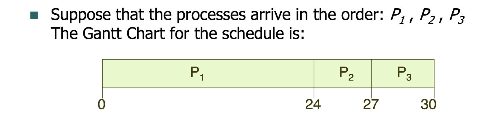
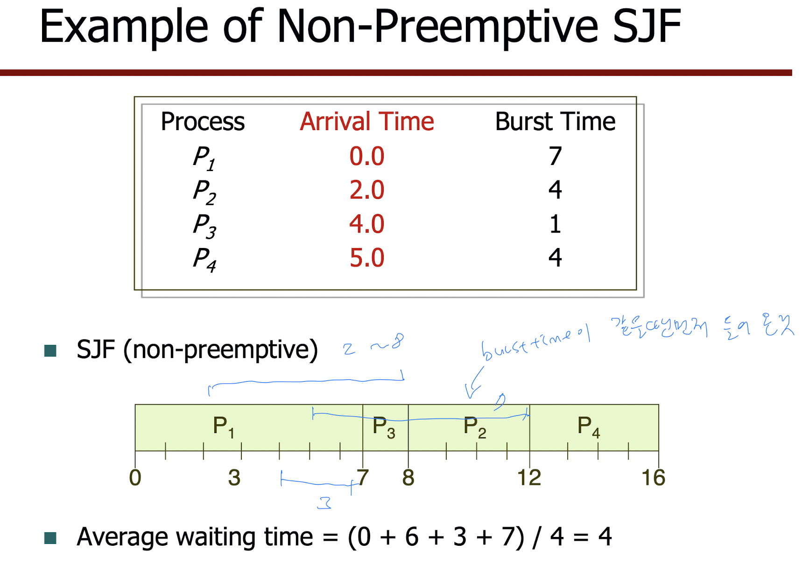
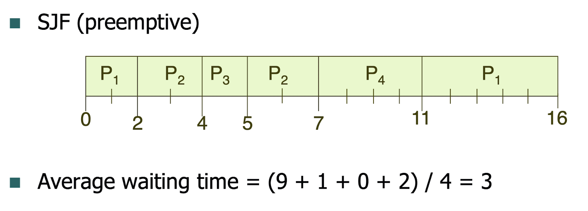
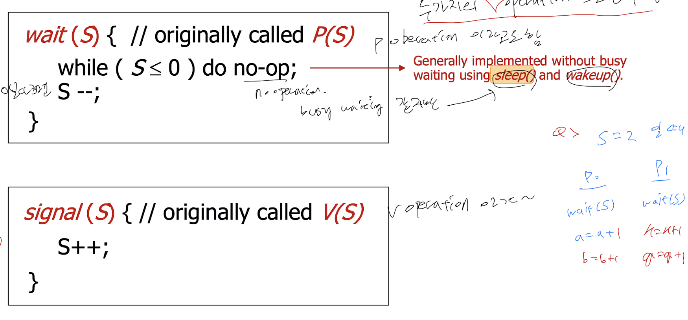
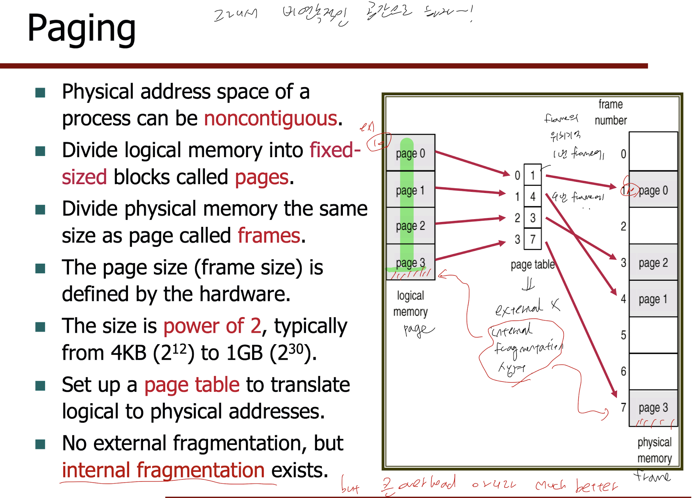
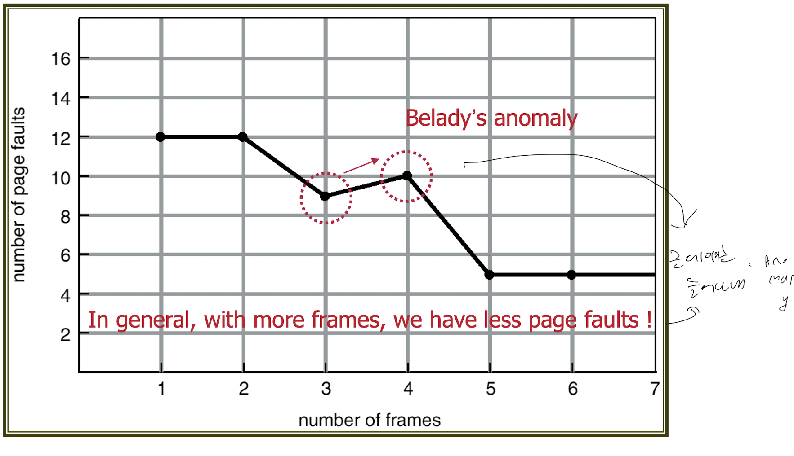
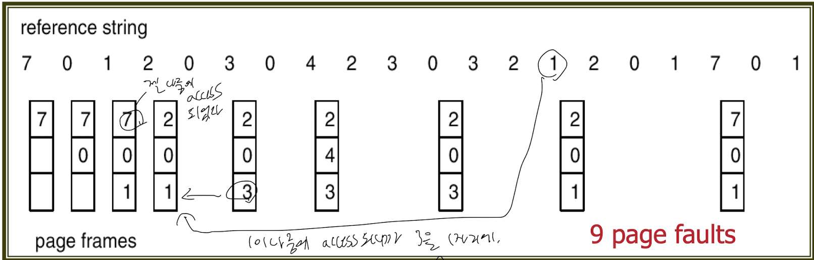
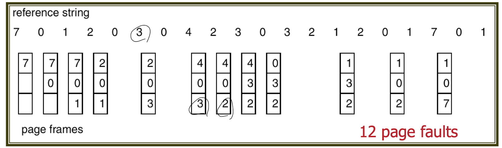

5주차

	•	CPU 스케줄링

등장배경: CPU 활용을 극대화하기 위해 멀티프로그래밍이 필요하다. 그런데
CPU core 한개로는 한번에 하나의 프로세스만 동작할 수 있다.
그렇기 때문에 CPU 스케줄링이 필요함
CPU 스케줄러는 메모리에 있는 프로세스 중 하나를 골라서 CPU에 할당해줌.
CPU 스케줄링은 waiting state -> ready state-> ready.. process 상태들에 개입하는데
스케줄링이 이 과정에서만 일어진다면 non-preemptive(비선점형) / cooperative라고 부름
나머지는 preemptive(선점형 스케줄링)임. 이게 요즘 자주 쓰는 방식임

I/O bound process: CPU burst(CPU 명령을 실행하는 시간)가 I/O burst보다 짧 
CPU bound process: I/O burst(I/O를 요청ㅇ한 다음 기다리는 시간)가 CPU burst보다 짧

스케줄링 알고리즘 종류

-FCFS : 먼저오는 프로세스가 먼저 CPU에 할당됨

문제점: Convoy effect (CPU burst 긴게 들어오면 짧은놈들은 오래 기다려야해서 CPU utilization 저조해짐)

-SJF(Shortest Job First)
선점형(=Shortest Remaining Time First, SRTF) vs 비선점형
평균 waiting time이 최소일때 유리. 다음 CPU burst 길이의 예측값을 아는게 어려움
예측방법 -> exponential averaging

burst time이 같을 때는 먼저 들어온거를 도중에 중단시키지 않고 쭉

먼저 들어온 process를 실행하다가도 더 짧은게 있다면 대체

-Priority Scheduling
정수의 우선순위가 프로세스별로 할당되고 숫자가 낮은 순으로 CPU 우선 할당됨
문제점: Starvation(=indefinite blocking) - 우선순위가 낮은 프로세스는 실행 안될수도
해결책: aging - 대기하고 있는 process들의 우선순위를 상승시킴

-Round-Robin Scheduling
각각의 프로세스는 time quantum(=time slice)라는 작은 CPU time unit을 가지는데, 이 시간이 지나면 프로세스가 선점되고 ready queue에 들어감.
P1 P2 P3 P4 프로세스의 burst time이 각각 53,17,68,24이며 Time quantum이 20일때
t_1 = 33/0/48/4 ..

SJF보다 average turnaround time이 높지만, 반응이 좋음. Time quantum이 너무 크면 FCFS이 되어버림. q는 context switch 정도의 시간 크기와 맞춰야함. 
cf) q가 극단적으로 작으면 process sharing이 되어버림.

80 percent rule이란?

-Multilevel Queue Scheduling

ready queue는 여러 queue로 나뉘어져 있는데, Foreground와 Background(batch) 작업을 하는 큐로 나뉜다. 앞단과 뒷단이라고 생각하면 되는데, 뒷단은 한꺼번에 입력을 시켜 한번에 돌린다.
우선순위가 높은 것이 Foreground queue. 빨리 동작해야되니 RR, Background는 좀 늦어도 되니 FCFS 스케줄링 알고리즘을 사용한다.

Multiple-Processor Scheduling이란?
Processor Affinity란?
Simultaneous Multithreading이란?

-Multilevel Feedback Queue Scheduling

	•	캐시(Cache)란

자주 사용되는 값이나 데이터를 미리 복사해 놓는 임시 저장소
우리가 컴퓨터를 사용할 때, CPU는 사용을 적게 할수록 성능이 좋아진다.(발열관련 문제)
하지만, 메모리는 사용을 적게 하거나 빵빵하게 사용한다고 해서 컴퓨터 성능에 영향을 주지 않는다.
이런 특징을 이용해서 메인 메모리(램)의 남는 공간을 활용해 페이지 캐시(page cache)라는 메모리 공간을 마련해 놓는다. 이 공간은 파일 I/O의 성능을 향상시키기 위해 사용되는 것으로, 사용된 파일의 내용을 저장해 놓았다가 다음에 read나 open할 시에 page cache를 활용하여 컴퓨터의 성능을 극대화 시킨다. (https://ddongwon.tistory.com/56)

Cache hit ratio와 Cache Locality에 대해 설명?

	•	데드락(DeadLock)
멀티프로세싱 환경에서 두 개 이상의 프로세스가 특정 자원할당을 무한정 대기하는 상태이다.

발생조건: 상호배제(Mutual Exclusive), 점유와 대기(Hold & wait), 비선점(Non preemption), circular wait
상호배제: 프로세스가 자원을 배타적으로 점유하여 다른 프로세스가 그 자원을 사용할 수 없는 상태. Critical Section(이하 CS)의 프로세스가 수행 중일때는 다른애랑 같이 수행 불가
점유와 대기: 한 프로세스가 자원을 점유하고 있으면서 또 다른 자원을 요청하여 대기하고 있는 상태. 현재 CS에 암것도 없는데, 어떠한 프로세스가 들어가려하는데 못들어가는 경우가 생기면 안된다. 그런 프로세스가 진행을 못하게되는 유일한 이유는 CS에 다른 process가 존재할 때만
비선점: 한 프로세스가 점유한 자원에 대해 다른 프로세스가 선점할 수 없고, 오직 점유한 프로세스만이 해제 가능한 상태
circular wait: 두 개 이상의 프로세스 간 자원의 점유와 대기가 하나의 원형을 구성한 상태

해결방법
Prevention, Avoidance, Detection, Recovery - 예방,회피,발견,복구
예방: 점유자원 해제 후 새 자원 요청
회피: 프로세스별 자원 최대요구량 확보. Banker's Algorithm, Bounded-wait 등
발견: 시스템의 상태를 감시 알고리즘 통해 교착상태 검사. 자원할당 그래프 등 이용
복구: 교착상태가 없어질 때까지 프로세스를 순차적으로 Kill하여 제거. Starvation 발생 가능

	•	Race Condition

여러 프로세스들이 공유하는 데이터를 동시에 접근할 때 발생하는 문제.
예를들어 counter++; counter--; 가 있을 때 이는 atomic하게, 즉 간섭 없이 동작해야한다.

	•	세마포어(Semaphore) & 뮤텍스(Mutex)

 process 안에는 critical section이라고 부르는 코드 segment가 존재하는데, 이를 구현하는 소프트웨어적인 접근. "Busy waiting"을 하지 않는 tool.
 Busy waiting: OS에서 원하는 자원을 얻을 때 까지 무한정 대기하는것. CPU의 자원을 무한정 사용하기 때문에 좋지 않은 동기화 방식

Mutex: 어떤 thread가 공유 자원을 획득하면 다른 thread는 공유 자원을 다 쓸때까지 기다림. 공유 자원을 다 사용한다면 그때 기다리고 있던 다른 thread를 깨움

	•	페이징 & 세그먼테이션 (PDF)

	•	페이지 교체 알고리즘

Page fault를 줄이기 위한 알고리즘

-FIFO //문제점: Belady's Anomaly

-Optimal Algorithm

-LRU(Least Recently Used) Algorithm

-Counting Based Algorithm : LFU, MFU (가장적게 access된 페이지, 많이된 페이지 교체)

 
