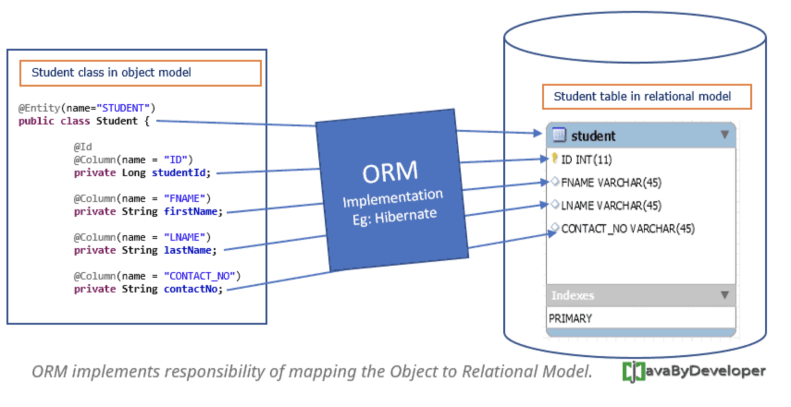

# 6주차

## 메모리(Memory)

## 파일 시스템

## 키(Key) 정리

키는 데이터베이스에서 조건을 만족하는 튜플을 찾거나 순서대로 정렬할 때 다른 튜플들과 구별할 수 있는 기준이 되는 속성이다.

키의 특성에는 **유일성**과 **최소성**이 있다.

유일성 : 식별자에 의해 엔터티 타입 내에 모든 엔터티들이 유일하게 구분된다.
최소성 : 최소한의 속성으로 식별자를 구성한다.

### 키 종류
- Primary Key(기본키) : 테이블의 각 튜플들을 고유하게 식별하는 Column.

- Alternate Key(대체키) : 후보 키 중에서 기본 키로 선택되지 않은 키.

  
- Candidate Key(후보키) : 테이블에서 각 튜플을 구별하는 데 기준이 되는 Column. 기본 키와 대체 키를 합친 키

  
- Super Key(슈퍼키) : 릴레이션을 구성하는 모든 튜플에 대해 **유일성**은 만족하지만 **최소성**은 만족하지 못하는 키.
  유일성: 하나의 키값으로 튜플을 유일하게 식별할 수 있는 성질
  최소성: 키를 구성하는 속성들 중 꼭 필요한 최소한의 속성들로만 키를 구성하는 성질
  
- Foreign Key(외래키) : 테이블 간의 참조 데이터 무결성을 위한 제약 조건. 한 릴레이션의 칼럼이 다른 릴레이션의 기본 키로 이용되는 키
  참조 데이터 무결성: 기본 키와 참조 키 간의 관계가 항상 유지됨을 보장. 참조되는 테이블의 행을 이를 참조하는 참조키가 존재하는 한 삭제될 수 없고, 기본키도 변경될 수 없음

  무결성의 종류?
  - 개체 무결성, 참조 무결성, 속성 무결성, 사용자 정의 무결성, 키 무결성

튜플 행(Row) cardinality
속성 열(Column) Degree
  
## SQL - 기본
Structured Query Language
데이터베이스에서 데이터를 추출하고 조작하는 데에 사용하는 데이터 처리 언어

## SQL - JOIN

조인은 두 개 이상의 테이블을 연결하여 데이터를 검색하는 방법이다. 두 릴레이션으로부터 관련된 튜플들을 결합하여 하나의 튜플로 만드는 가장 대표적인 데이터 연결 방법이다.

논리적 조인 유형
- Inner Join(내부 조인)
Inner 생략해도 됨. 공통 존재 Column의 값이 같은 경우를 추출하는 기법.
  
- Outer Join(외부 조인)
Left Outer Join vs Right Outer Join
  
- Cross Join(교차 조인)
조인 조건이 없는 모든 데이터 조합을 추출.
  
- Self Join(셀프 조인)
자기 자신에게 별칭(Alias)을 지정한 후에 다시 조인.

## SQL Injection

응용 프로그램의 보안 취약점을 이용해서 악의적인 SQL 구문을 삽입하고 실행시켜 DB의 접근을 통해 정보를 탈취하거나 조작 등의 행위를 하는 공격기법.

공격 유형
- Form SQL Injection : HTML Form 기반 인증을 담당하는 애플리케이션의 취약점이 있는 경우 사용자 인증을 위한 쿼리 문의 조건을 임의로 조작하여 인증을 우회하는 기법
- Union SQL Injection : 쿼리의 UNION 연산자를 이용하여 한 쿼리의 결과를 다른 쿼리의 결과에 결합하여 공격하는 기법
- Stored Procedure SQL Injection : 저장 프로시저를 이용하여 공격하는 기법
- Mass SQL Injection : 기존 SQL Injection의 확장된 개념으로, 한 번의 공격으로 대량의 DB값이 변조되어 홈페이지에 영향을 미치는 기법
- Error-Based SQL Injection : DB 쿼리에 대한 에러값을 기반으로 한 단계씩 점진적으로 DB 정보를 획득할 수 있는 기법
- Blind SQL Injection

방식 예
SELECT * FROM USER WHERE ID = 'admin' AND password = 'XX' OR 1=1 <- 1=1이 무조건 참이므로 로그인 통과

대책: binding 매개변수 방식을 적용하여 사전에 변수 타입을 명시적으로 지정
사용자로부터 입력될 수 있는 모든 값을 체크하여 필터링
Java: Servlet Filter 기능 적용

## SQL vs NoSQL
SQL은 관계형 데이터베이스로 데이터의 중복 문제 같은 문제로부터 무결성을 보장한다.

NoSQL은 기존의 Not SQL의 약어로, 기존의 SQL과는 다르게 저장 형식이 스키마에 얽메이지 않는다. 스키마가 존재하지 않음

NoSQL 데이터베이스 유형
- {Key,Value} 형식으로 데이터가 저장 ex)Redis
- JSON과 같은 Document 형식으로 데이터 저장 ex)MongoDB
- Wide Column Store
- Graph

Join 연산이 필요 없지만 중복된 데이터가 들어갈 가능성이 적고 많이 읽는데 데이터가 자주 변화하지 않는다면 효율적이다.
정형화되지 않은 대용량 데이터를 저장하는 경우 효율적이다.
클라우드 컴퓨팅 및 저장공간을 최대한 활용하는 경우 효율적
빠르게 서비스를 구축하는 과정에서 데이터 구조를 자주 변경해야 하는 경우

+그럼 NoSQL에서 Join을 하고싶다면 어떻게 할까? : 컬렉션을 통해 데이터를 복제하여 각 컬렉션 일부분에 속하는 데이터를 정확히 산출.

## 레디스(Redis)

Remote Dictionary Server의 약어로, Key-value 형식으로 데이터가 저장되는 관계형 데이터베이스
Cache처럼 In-Memory DB로, 자주 접근하고 자주 바뀌지 않는 데이터임.

+Java HashMap과 비교하면? 
Java HashMap도 똑같이 In-memory DB인데 Java의 경우 서버가 여러대면 Consistency의 문제, 멀티쓰레드 환경에서 Race condition이 발생함
Redis는 Single Threaded이고 Atomic하며 서로 다른 트랜젝션 r/w을 동기화하기 때문에 race condition 문제 해결.
쉽게말해서 Redis의 자료구조는 Atomic해서 Critical Section에 대한 동기화를 제공함

사용처: 여러 서버에서 같은 데이터를 공유할 때
Single Server에서 Atomic한 자료구조 + 캐시 기능을 사용하기 위해

In-memory DB라 Memory fragementation 문제와 virtual memory를 알아야함.

In-memory DB 정리

## ORM(Object-Relational Mapping)

객체와 관계형 DB의 데이터를 자동으로 매핑해주는 것.
객체지향 프로그래밍: Class 사용, RDB: Table 사용. 불일치.
ORM을 통해 객체 간의 관계를 바탕으로 SQL을 자동으로 생성하여 불일치를 해결

장점: 직관적이고 비즈니스 로직에 더 집중 가능, 재사용 및 유지보수 편리성 증가, DBMS에 대한 종속성이 줄어든다
단점: 잘못 구현하면 속도저하 및 일관성 감소

